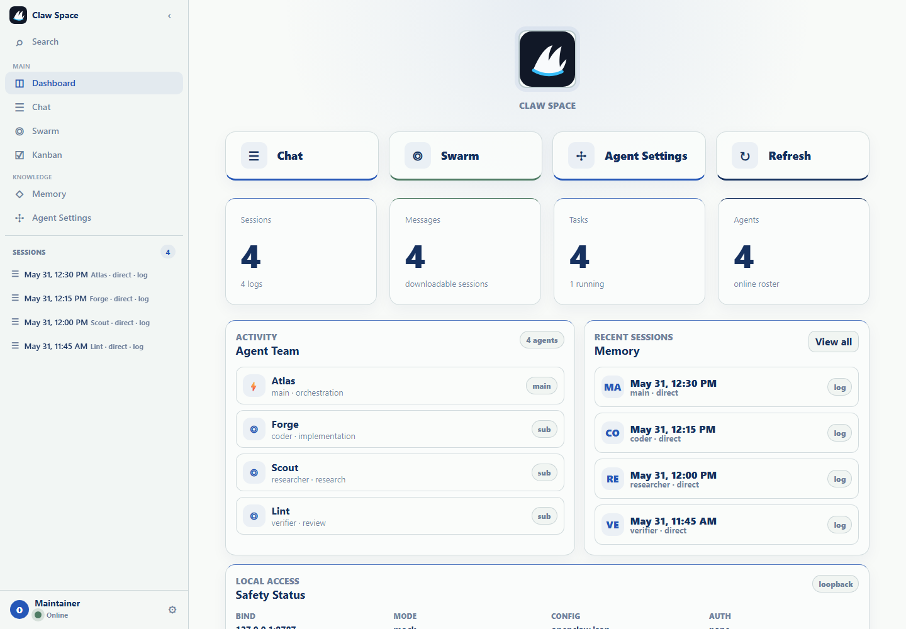
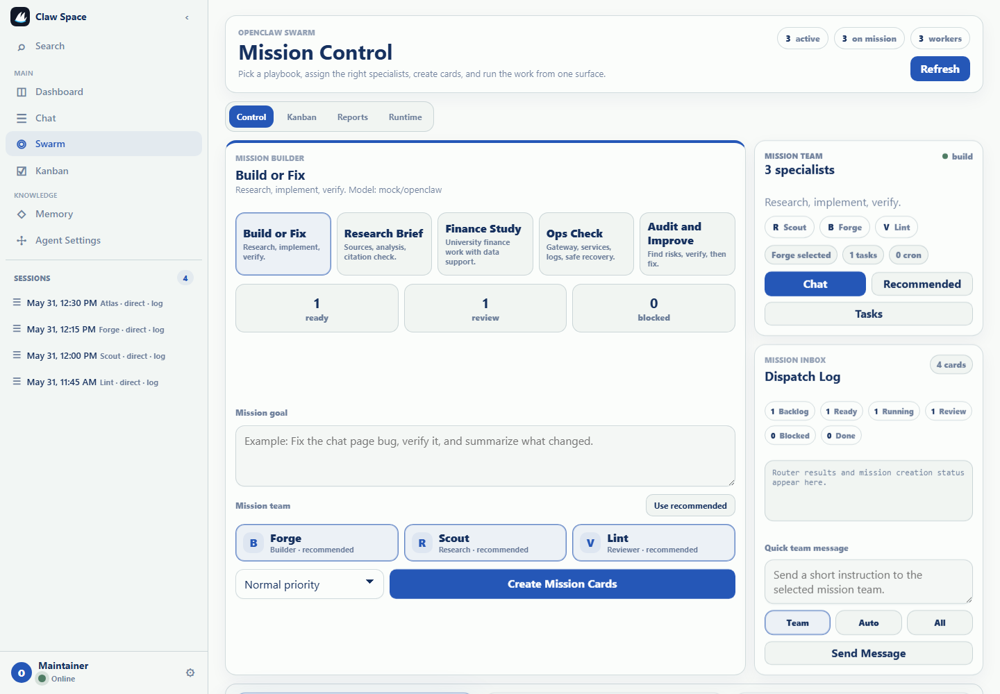
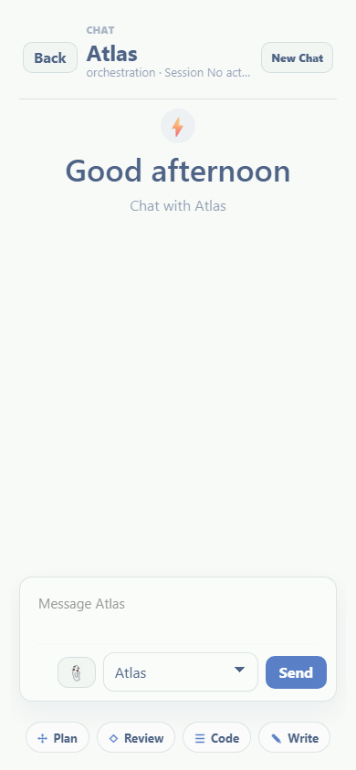

# Showcase

These screenshots are generated from mock OpenClaw data. They are meant to show the UI shape without publishing private session logs, memory files, config paths, or local workspace names.

## Dashboard

The dashboard is the workspace landing view. It combines the agent roster, recent sessions, task counters, and local access status so contributors can quickly tell whether they are looking at a mock workspace or a live loopback server.

## Swarm Board

The swarm view is a planning surface for multi-agent work. It keeps the mission form, worker cards, lane status, and runtime output close together so a maintainer can inspect what happened before moving work forward.

## Mobile Layout

The mobile layout keeps the active work surface full-screen. Chat has an explicit Back control, and the bottom navigation includes the Memory view so the same core workflow is reachable on narrow screens.
